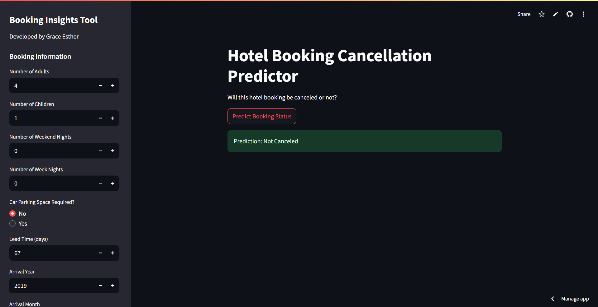
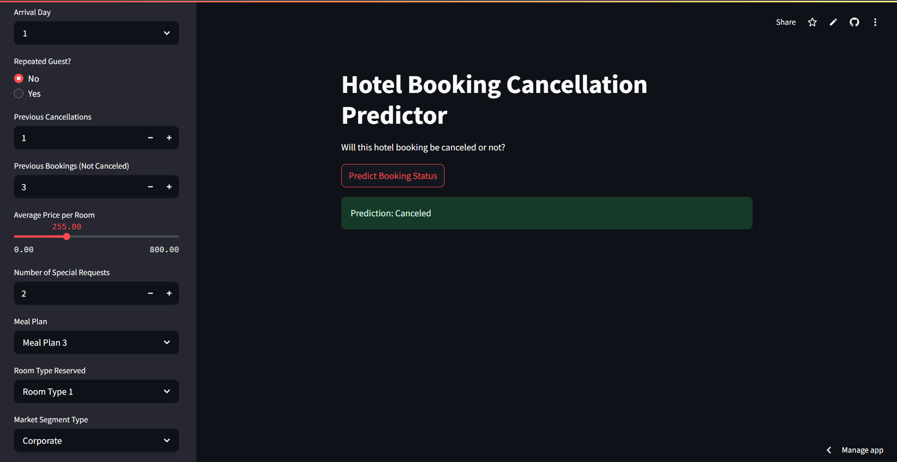

# 🏨 Hotel Booking Status Classifier

A machine learning project that predicts whether a hotel booking will be honored or canceled using structured data.

---

## 📌 Project Overview

This project aims to help hotel management predict booking cancellations by developing a machine learning model based on historical booking data. Using the XGBoost algorithm, the model determines whether a booking will be confirmed or canceled. The dataset includes various features such as lead time, market segment, customer type, and seasonal factors.

To improve usability and practical application, the model is integrated into an interactive Streamlit web application, enabling users to upload new data and receive real-time predictions through an intuitive interface. This approach enhances accessibility for non-technical users and supports informed decision-making in hotel operations.

---

## 🚀 Live Demo

You can explore the model's predictions in real-time via this interactive **Streamlit web application**. Try uploading your own data to see how the model predicts booking status.

[Visit the Streamlit app here](https://reservation-flow.streamlit.app/)

---

## 🔍 Key Features

- Robust data preprocessing pipeline including imputation, encoding, and feature scaling  
- Feature selection and engineering tailored to improve model generalization  
- Implementation of the XGBoost classifier with hyperparameter optimization  
- Evaluation using metrics such as accuracy, precision, recall, and F1-score  
- Object-oriented code architecture for scalability and deployment readiness  

---

## 🖼️ Streamlit Application Output
### Not Canceled

### Canceled

